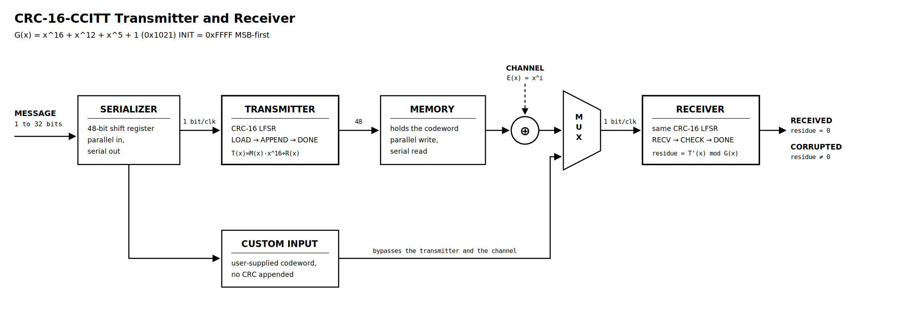

# CRC-16-CCITT Transmitter & Receiver on FPGA


A bit-serial CRC-16 link — transmitter, codeword memory, error-injecting channel and receiver —
written in Verilog and running on an Avnet **ZedBoard**. The receiver verifies by **polynomial
residue**, not by recomputing and comparing, so it can validate a codeword it has never seen before.

> **Reconfigurable Computing — Lab Assignment 2, Question 2**
> Birla Institute of Technology and Science, Pilani *(CS G553)*



---

## Contents

- [What it does](#what-it-does)
- [Results at a glance](#results-at-a-glance)
- [How CRC works](#how-crc-works)
- [Architecture](#architecture)
- [Board interface](#board-interface)
- [Build](#build)
- [Running it](#running-it)
- [Resources consumed](#resources-consumed)
- [Latency](#latency)
- [Throughput](#throughput)
- [Timing closure](#timing-closure)
- [Power](#power)
- [Verification](#verification)
- [Design decisions](#design-decisions)
- [Known limitation](#known-limitation)
- [Repository layout](#repository-layout)

---

## What it does

Type a message into the VIO, press a button, and the transmitter serialises it one bit per clock
through a Galois LFSR, appends the 16-bit remainder and stores the codeword. Press another button
and the codeword streams through a channel that can flip any bit you name, into a receiver that
divides the whole thing by the same generator and lights **RECEIVED** or **CORRUPTED**.

A second input path lets you type a codeword *by hand* and feed it straight to the receiver,
bypassing the transmitter entirely — which is how you prove the receiver is doing real division, and
how you inject burst errors the single-bit channel can't produce.

```
G(x) = x^16 + x^12 + x^5 + 1   (0x1021)
INIT = 0xFFFF,  MSB-first,  no reflection,  no final XOR
```

**Features**

- Variable message length, 1–32 bits, set at runtime — no rebuild
- Bit-serial interface into the transmitter, as the assignment requires
- FSMD throughout: control FSM + separate datapath in every block
- Runtime single-bit error injection by index, in flight, without modifying stored data
- OVERRIDE multiplexer selecting transmitter output or a user-supplied codeword
- No IP cores other than the Xilinx VIO
- 350 self-checking simulation assertions against an independent long-division golden model

---

## Results at a glance

| | |
|---|---|
| Throughput (CRC engine) | 1 bit/clock — **100 Mbit/s** @ 100 MHz |
| End-to-end latency, 32-bit message | 87 cycles — **870 ns** |
| Latency, load phase | *L* + 5 cycles |
| Latency, transmit + verify | *L* + 18 cycles |
| **WNS** | **+3.684 ns** on a 10 ns constraint |
| **WHS** | +0.077 ns |
| **F<sub>max</sub>** | **158.3 MHz** — 58 % headroom |
| Slice LUTs | 1197 total — **271 are user logic** (0.51 %) |
| Slice Registers | 2006 total — **332 are user logic** (0.31 %) |
| BRAM / DSP | **0 / 0** |
| Total on-chip power | 0.119 W (0.013 W dynamic) |
| Simulation checks | 350 pass / 0 fail |
| Route status | 2644 / 2644 nets routed, 0 errors |

Two numbers worth reading together. The whole CRC design is **271 LUTs and 332 flip-flops**. The VIO
core and JTAG debug hub that Vivado inserts come to **926 LUTs and 1674 flip-flops** — the debug
infrastructure is 3.4× the logic and 5× the registers of the circuit it observes. Within the design,
one CRC engine is 16 flip-flops and 3 XOR gates.

And the critical path is not the CRC. It runs `par_len[3] → sr_reg[39]` through five LUTs of the
serializer's variable left-shift — the barrel shifter is simultaneously the largest and the slowest
block in the design.

---

## How CRC works

### Polynomial arithmetic over GF(2)

A CRC treats a bit string as the coefficients of a polynomial over GF(2), the field with two
elements. In GF(2) addition and subtraction are both XOR, so polynomial long division needs no
borrows and no magnitude comparison — at each step you either subtract the generator or you don't,
decided purely by the leading coefficient.

Given a message polynomial $M(x)$ of degree $L-1$ and a fixed **generator** $G(x)$ of degree 16, the
transmitter computes

$$R(x) = M(x)\cdot x^{16} \bmod G(x), \qquad T(x) = M(x)\cdot x^{16} + R(x)$$

Shifting the message up by 16 makes room for the remainder; adding the remainder back makes $T(x)$
an exact multiple of $G(x)$ by construction.

### Why it detects errors

The receiver does **not** recompute the CRC and compare. It divides the *entire* received word —
message and CRC together — by the same $G(x)$ and checks that the remainder is zero. This is cheaper
(one LFSR, no comparator, no stored copy) and it makes the algebra exact.

Write the received word as $T'(x) = T(x) + E(x)$, where the error polynomial $E(x)$ has a 1 in every
corrupted bit position. Since $G \mid T$,

$$T'(x) \bmod G(x) = E(x) \bmod G(x)$$

**The syndrome depends only on the error pattern, never on the data.** An error is missed if and only
if $E(x)$ is itself a multiple of $G(x)$. Every guarantee follows from that one fact:

| Error class | Detected? | Reason |
|---|---|---|
| Any single bit | **always** | $E = x^i$; a monomial can never have a degree-16 factor |
| Any odd number of bits | **always** | $(x+1) \mid G(x)$, and every multiple of $(x+1)$ has even weight |
| Any burst of length ≤ 16 | **always** | $E = x^j B(x)$ with $\deg B < 16$, so $G \nmid E$ |
| Burst of length exactly 17 | all but 1 in $2^{15}$ | only $E = x^j G(x)$ escapes |
| Random longer patterns | $1 - 2^{-16}$ | ≈ 99.9985 % |

### The INIT value cancels

Seeding the register with a constant $I$ adds a term $I\cdot x^{L+16}$ at the transmitter and the
identical term at the receiver. Over GF(2) these are the same quantity and they XOR to zero, so the
residue of a clean codeword is zero for *any* seed as long as both ends use the same one.
`INIT = 0xFFFF` exists only so a message of leading zeros produces a non-trivial CRC.

### Hardware form — the Galois LFSR

Long division one bit at a time is a 16-bit shift register with taps. If $R_k$ is the remainder after
$k$ message bits and $d$ is the next bit,

$$R_{k+1} = \big(R_k \cdot x + d\cdot x^{16}\big) \bmod G(x)$$

Multiplying by $x$ is a left shift. The bit shifted out, $R_k[15]$, is the coefficient at $x^{16}$;
combined with the incoming $d$ it forms the **quotient bit** of this division step:

$$fb = d \oplus R_k[15]$$

If $fb = 1$ the generator is subtracted (XORed) back in; if $fb = 0$ it is not. That is the whole
algorithm, and the whole module:

```verilog
wire fb = din ^ crc[15];

always @(posedge clk) begin
    if (rst)      crc <= INIT;
    else if (en)  crc <= {crc[14:0], 1'b0} ^ (fb ? G : 16'h0000);
end
```

Sixteen flip-flops and three XOR gates, one bit per clock. Identical hardware serves the transmitter
(fed the message, produces $R(x)$) and the receiver (fed message + CRC, produces the residue), which
is why `CRC16.v` is written once and instantiated twice.

---

## Architecture

Every block follows the **FSMD** style: a control FSM driving a separate datapath.

| Module | Role |
|---|---|
| `CRC16.v` | Shared Galois LFSR primitive — 16 FFs, 1 bit/clk |
| `SERIALIZER.v` | 48-bit shift register; parallel VIO write → 1-bit-per-clock stream |
| `CRC_TX.v` | FSM `LOAD → APPEND → DONE`; absorbs the message, appends $R(x)$ |
| `MSG_MEM.v` | Codeword store; parallel write, non-destructive serial read; exports `rd_index` |
| `CustomBuff.v` | Second source — a codeword typed by the user, no CRC appended |
| `CRC_CORE.v` | Structural glue, edge detection, channel, OVERRIDE mux |
| `CRC_RX.v` | FSM `RECV → CHECK → DONE`; asserts RECEIVED or CORRUPTED from the residue |
| `CRC_TOP.v` | Pin mapping, 2-flop synchronisers, VIO instance, LED assignment |

### Serial entry

The assignment requires data to reach the transmitter one bit at a time, and permits doing so either
with a MUX addressed by a counter or with *"a shift register to send the values, loading the shift
register using the VIO"*. This design takes the second option. The user writes a full word and its
length into the VIO once; `SERIALIZER.v` left-aligns it so the MSB sits at the shift tap and emits it
at exactly one bit per clock. The transmitter's interface is strictly serial — the parallel-to-serial
conversion is hardware, not a shortcut.

### Variable length

`par_len[5:0]` sets the message length from 1 to 32 bits at runtime. `msg_len` counts the bits
actually absorbed, `cw_len = msg_len + 16`, and every read pointer is initialised from the stored
length. No parameter change or rebuild is needed.

### The channel and error injection

`MSG_MEM.v` exports the index of the bit currently being read. The channel is one XOR gate:

```verilog
wire err_bit = err_en & mem_valid & (mem_index == err_index);
wire mem_bit = mem_bit_raw ^ err_bit;
```

A literal hardware realisation of $E(x) = x^i$. The memory contents are never modified — the
corruption happens in flight — so the VIO still shows the transmitted codeword while the receiver
sees the corrupted one. Good memory, bad channel.

### The OVERRIDE multiplexer

`override` selects which source feeds the receiver: the transmitter's codeword out of `MSG_MEM`, or
a codeword typed by hand into `CustomBuff`. The second path is what proves the receiver is a real
divider rather than a comparator — nothing in the design computed a CRC for a hand-typed word, yet
the receiver still decides correctly. It is also the only way to inject multi-bit and burst error
patterns, which the single-bit channel injector cannot produce.

### Control

Five asynchronous board inputs pass through 2-flop synchronisers in `CRC_TOP.v`; `CRC_CORE.v` then
converts the level signals into single-cycle pulses by edge detection — mandatory for the VIO, whose
JTAG-written registers hold their value for ~10⁸ cycles.

---

## Board interface

| Control | Signal | Pin | Function |
|---|---|---|---|
| **BTNL** | `btn_par_load` | `N15` | Load the VIO word into the selected destination |
| **BTNR** | `btn_start_tx` | `R18` | Stream the selected source to the receiver |
| **BTND** | `btn_rst` | `R16` | Reset |
| **SW0** | `sw_override` | `F22` | Receiver source: 0 = memory, 1 = custom buffer |
| **SW1** | `sw_load_sel` | `G22` | Load destination: 0 = transmitter, 1 = custom buffer |

| LED | Pin | Meaning |
|---|---|---|
| LD0 | `T22` | RECEIVED |
| LD1 | `T21` | CORRUPTED |
| LD2 | `U22` | `tx_ready` |
| LD3 | `U21` | `rx_done` |
| LD4 | `V22` | `override` |
| LD5 | `W22` | `load_sel` |

Clock: **`Y9`**, 100 MHz PL oscillator, bank 13.

---

## Build

### Vivado

1. Create an RTL project, part **`xc7z020clg484-1`** (or board *ZedBoard Zynq Evaluation and Development Kit*).
2. Add `rtl/*.v` as **design sources**, `sim/*.v` as **simulation sources**, `constraints/CRC_CONSTRAINTS.xdc` as a constraint.
3. Set `crc_top` as top.
4. IP Catalog → **VIO (Virtual Input/Output) 3.0** → name it `vio_0`:

   | Probe | Width | Signal |
   |---|---|---|
   | `probe_in0` | 48 | `codeword` |
   | `probe_in1` | 16 | `crc_out` |
   | `probe_in2` | 16 | `residue` |
   | `probe_in3` | 6 | `cw_len` |
   | `probe_in4` | 6 | `msg_len` |
   | `probe_in5` | 6 | `cust_len` |
   | `probe_in6` | 3 | `tx_state` |
   | `probe_out0` | 1 | `clr` |
   | `probe_out1` | 1 | `err_en` |
   | `probe_out2` | 6 | `err_idx` |
   | `probe_out3` | 48 | `par_data` |
   | `probe_out4` | 6 | `par_len` |

5. Run Synthesis → Implementation → Generate Bitstream.
6. Open Hardware Manager and program the device with **both** `crc_top.bit` and `crc_top.ltx`
   (without the `.ltx` the probes come up unnamed).

Set the VIO radixes to **Hex** for `par_data`, `codeword`, `crc_out`, `residue` and **Unsigned
Decimal** for `par_len`, `err_idx`, `msg_len`, `cw_len`, `cust_len`.

> **Press `clr` once after programming.** Flip-flops power up to 0, so `crc_out` and `residue` must
> read `FFFF` before the first load.

### Simulation with Icarus Verilog

```bash
iverilog -o crc_tb  sim/TB_CRC16.v     sim/CRC_REF.v rtl/CRC16.v && vvp crc_tb
iverilog -o core_tb sim/TB_CRC_CORE.v  sim/CRC_REF.v rtl/*.v     && vvp core_tb
iverilog -o lat_tb  sim/TB_LATENCY.v                 rtl/*.v     && vvp lat_tb
```

### Collecting implementation reports

```tcl
source vivado/collect_reports.tcl
```

Writes utilisation, timing, clock and power reports into `reports/` and prints a digest.

---

## Running it

### Clean transmission — SW0 down, SW1 down

```
par_data = D,  par_len = 4     →  press BTNL
   msg_len 4 | crc_out DFB2 | cw_len 20 | codeword DDFB2 | LD2 on
press BTNR
   LD0 RECEIVED | residue 0000
```

### Inject a single-bit error

Leave the codeword loaded, set `err_en = 1`, and change `err_idx`:

| `err_idx` | Hits | Residue | Verdict |
|---:|---|---|---|
| 19 | message MSB | `A9A1` | CORRUPTED |
| 16 | message LSB | `3730` | CORRUPTED |
| 15 | CRC MSB | `1B98` | CORRUPTED |
| 9 | CRC | `6662` | CORRUPTED |
| 3 | CRC | `8108` | CORRUPTED |
| 0 | CRC LSB | `1021` | CORRUPTED |

`codeword` stays `DDFB2` throughout — the bit is flipped in flight, not in memory. Bits 19–16 are
the message and 15–0 are the CRC, and both are protected equally.

### The burst boundary

SW1 up, type a codeword into the custom buffer, SW1 down, SW0 up, press BTNR:

| Input | Error | Verdict | Residue |
|---|---|---|---|
| `DDFB2` | none | RECEIVED | `0000` |
| `DDFB3` | 1 bit | CORRUPTED | `1021` |
| `22042` | 16-bit burst, bits 4–19 | CORRUPTED | `C0D1` |
| `55EBA` | 4 bits spanning 17 positions | **RECEIVED** | `0000` |

The last row is not a bug. `55EBA = DDFB2 ⊕ (G << 3)` — the error pattern is an exact multiple of the
generator, so it divides evenly and the check passes. Sixteen-wide bursts are always caught;
seventeen is one past the guarantee.

---

## Resources consumed

Post-implementation, Vivado 2025.2, `xc7z020clg484-1`, fully routed.

| Resource | Used | Available | Util % |
|---|---:|---:|---:|
| Slice LUTs | **1197** | 53,200 | 2.25 |
| &nbsp;&nbsp;— LUT as Logic | 1173 | 53,200 | 2.20 |
| &nbsp;&nbsp;— LUT as Distributed RAM | 24 | 17,400 | 0.14 |
| Slice Registers (all flip-flops) | **2006** | 106,400 | 1.89 |
| Occupied Slices | 546 | 13,300 | 4.11 |
| F7 / F8 Muxes | 7 / 3 | 26,600 / 13,300 | 0.03 / 0.02 |
| **Block RAM Tile** | **0** | 140 | 0.00 |
| **DSP48E1** | **0** | 220 | 0.00 |
| Bonded IOB | 12 | 200 | 6.00 |
| BUFGCTRL | 2 | 32 | 6.25 |
| BSCANE2 | 1 | 4 | 25.00 |
| Unique control sets | 92 | 13,300 | 0.69 |

Primitives: FDRE 1737, FDCE 184, FDSE 44, FDPE 41 (= 2006 FFs); LUT4 410, LUT6 396, LUT5 209,
LUT3 175, LUT2 132, LUT1 27 (1349 LUT primitives packed into 1173 LUT sites — 176 use both the O5 and
O6 outputs); CARRY4 12, MUXF7 7, MUXF8 3, IBUF 6, OBUF 6, BUFG 2, BSCANE2 1.

### Hierarchical breakdown

| Instance | LUTs | Registers | Slices | F7 / F8 | LUT as Mem |
|---|---:|---:|---:|---:|---:|
| `crc_top` (total) | 1197 | 2006 | 546 | 7 / 3 | 24 |
| &nbsp;&nbsp;`u_core` — **the CRC design** | **271** | **320** | 121 | 7 / 3 | 0 |
| &nbsp;&nbsp;`u_vio` (VIO 3.0 debug core) | 477 | 933 | 240 | 0 / 0 | 0 |
| &nbsp;&nbsp;`dbg_hub` (JTAG debug hub) | 449 | 741 | 218 | 0 / 0 | 24 |
| &nbsp;&nbsp;`crc_top` leaf (synchronisers) | 0 | 12 | — | 0 / 0 | 0 |

**User logic is 271 LUTs and 332 flip-flops** — `u_core` plus the twelve synchroniser registers at
the top level. That is 0.51 % of the LUTs and 0.31 % of the registers on the XC7Z020.

The debug infrastructure accounts for **926 LUTs and 1674 flip-flops**: 3.4× the logic and 5.0× the
registers of the circuit it observes. Worth stating plainly so the headline 2.25 % figure is not
mistaken for the cost of the CRC — and it is a real design consideration, since removing one
instantiation removes the debug core and the deliverable fits in under 300 LUTs.

Predicted from the RTL by hand, for comparison:

| Block | FFs (RTL) |
|---|---:|
| `crc16` × 2 (TX + RX LFSRs) | 32 |
| `serializer` (48-bit `sr`, count, flags) | 57 |
| `crc_tx` (`msg_buf` 48, `cw_data` 48, lengths, FSM) | 111 |
| `msg_mem` | 62 |
| `custom_buff` | 61 |
| `crc_rx` | 5 |
| `crc_core` glue (edge detect, `dest_sel`, `ser_busy_d`) | 5 |
| `crc_top` synchronisers | 10 |
| **Predicted** | **343** |
| **Implemented** | **332** |

Synthesis trimmed eleven registers that drive nothing — unused observation outputs and buffer bits no
path can reach given `MAX_MSG = 32`.

### Where the area actually goes

**No BRAM and no DSP are inferred**, which is correct: `MSG_MEM` and `CustomBuff` are single 48-bit
registers with a 48:1 read multiplexer, not memories. At this size fabric flops and LUTs are cheaper
than a block RAM.

The hierarchy confirms this directly — **all 7 F7 muxes and all 3 F8 muxes in the design sit inside
`u_core`**, and nowhere else. Those are the dedicated wide-multiplexer primitives Vivado uses to build
48:1 read ports out of LUT6s. Conversely `u_core` uses *zero* LUTs as distributed RAM; all 24 belong
to `dbg_hub`.

The CRC engine itself is negligible: **16 flip-flops and 3 XOR gates** per instance. The area is
dominated by plumbing — the 48-bit buffers, their read multiplexers, and above all the **barrel
shifter** in `SERIALIZER.v`:

```verilog
sr <= par_data << (WIDTH - par_len);
```

A 48-bit variable shift with a 6-bit shift amount — roughly six stages of 48 multiplexers. Loading
right-aligned and counting up instead would remove it almost entirely. It was kept because it makes
the MSB-first tap position trivially correct, and there is 3.7 ns of slack to spare.

### Design rule checks

| Report | Result |
|---|---|
| `report_drc` (routed) | 5 warnings — 3 × PDCN-1569, 1 × RTSTAT-10 (all inside `dbg_hub`), 1 × ZPS7-1 |
| `report_methodology` | 4 warnings — LUTAR-1, all inside `dbg_hub` FIFO reset logic |
| Route status | 2644 / 2644 routable nets routed, **0 routing errors** |

**Zero DRC or methodology violations originate in user logic.** ZPS7-1 ("PS7 block required") is
expected: this is a PL-only design on a Zynq part with no processing system instantiated.

---

## Latency

Measured by simulation (`sim/TB_LATENCY.v`) rather than estimated. *L* = message bits,
*N* = *L* + 16 = codeword bits, 100 MHz clock.

| Phase | Cycles | 32-bit message |
|---|---|---|
| Load: serialise *L* bits, compute CRC, append, write memory | *L* + 5 | 37 cyc = **370 ns** |
| Transmit: stream *N* bits through the channel, divide, decide | *N* + 2 | 50 cyc = **500 ns** |
| **End-to-end** | **2*L* + 23** | 87 cyc = **870 ns** |

| *L* | *N* | Load | Transmit + check | Total |
|---:|---:|---:|---:|---:|
| 4 | 20 | 9 cyc / 90 ns | 22 cyc / 220 ns | 31 cyc / 310 ns |
| 8 | 24 | 13 cyc / 130 ns | 26 cyc / 260 ns | 39 cyc / 390 ns |
| 16 | 32 | 21 cyc / 210 ns | 34 cyc / 340 ns | 55 cyc / 550 ns |
| 32 | 48 | 37 cyc / 370 ns | 50 cyc / 500 ns | 87 cyc / 870 ns |

The fixed overheads are small and constant: 5 cycles on the load side (serializer pipeline, the
`APPEND` state, the memory write) and 2 on the receive side (`CHECK`, then registering the verdict).
Latency is **linear in message length** because the datapath is bit-serial by design.

---

## Throughput

| Measure | Value |
|---|---|
| CRC engine — peak | **1 bit/clock = 100 Mbit/s @ 100 MHz** |
| Channel — peak | 1 bit/clock = 100 Mbit/s |
| Payload during the transmit phase, *L* = 32 | 32 bits / 500 ns = **64 Mbit/s** |
| Payload end-to-end, *L* = 32 | 32 bits / 870 ns = **36.8 Mbit/s** |
| Code rate | *L*/(*L*+16) = 32/48 = **0.67** |
| Peak rate at the achieved F<sub>max</sub> (158 MHz) | 158 Mbit/s |

The LFSR sustains one bit every cycle with no stalls, so raw throughput equals the clock rate. The
end-to-end figure is lower for two structural reasons: 16 of every *L*+16 transmitted bits are check
bits rather than payload, and this design **serialises the load and transmit phases** — the message is
fully absorbed before streaming begins, because `MSG_MEM` must hold the complete codeword for the
OVERRIDE mux and the error injector to address it by index.

Overhead is a fixed 16 bits regardless of *L*, so efficiency improves with longer messages — 67 % code
rate at *L* = 32, 96 % at *L* = 512. The 32-bit cap is the assignment's, not the architecture's.

---

## Timing closure

**All user-specified timing constraints are met.**

| | Value |
|---|---|
| Constraint | 10.000 ns (100 MHz), `sys_clk` |
| **WNS** (setup) | **+3.684 ns** |
| TNS | 0.000 ns — **0 failing of 3636 endpoints** |
| **WHS** (hold) | **+0.077 ns** |
| THS | 0.000 ns — 0 failing of 3620 endpoints |
| WPWS (pulse width) | +3.750 ns — 0 failing of 2056 endpoints |
| **F<sub>max</sub>** | **158.3 MHz** = 1000 / (10.000 − 3.684) |

**58 % of the timing budget remains unused** at the 100 MHz board clock.

### The critical path

| | |
|---|---|
| Source | `u_vio` → `par_len[3]` |
| Destination | `u_core/u_ser/sr_reg[39]/D` |
| Data path delay | 6.296 ns — logic 1.672 ns (26.6 %), routing 4.624 ns (73.4 %) |
| Logic levels | 5 (LUT6 × 2, LUT5 × 2, LUT4 × 1) |

```
par_len[3] → sr[2]_i_4 → sr[47]_i_17 → sr[41]_i_3 → sr[39]_i_2 → sr[39]_i_1 → sr_reg[39]
```

Every intermediate LUT belongs to the serializer's variable left-shift. This confirms the area
analysis from the other direction: **the barrel shifter is simultaneously the largest and the slowest
block in the design, and the CRC engine is neither.** The LFSR's own path —
`fb = din ^ crc[15]` followed by one XOR into the generator — is two levels of logic and never
appears near the top of the path list.

Routing accounts for 73 % of the delay, characteristic of a small, sparsely placed design: the logic
is spread across two clock regions (X1Y0 and X1Y1) with nothing forcing it together.

`check_timing` reports 5 input ports and 6 output ports with no input/output delay but with a
false-path constraint — exactly the five board inputs and six LEDs declared in the XDC. The
asynchronous paths are excluded as intended, and nothing else is unconstrained.

---

## Power

| | Value |
|---|---|
| Total on-chip power | **0.119 W** |
| Dynamic | 0.013 W |
| Device static | 0.106 W |
| Junction temperature | 26.4 °C at 25 °C ambient |
| Maximum ambient | 83.6 °C |

Dynamic power by hierarchy: `u_vio` 0.005 W, `dbg_hub` 0.003 W, **`u_core` 0.002 W**. As with area,
the debug infrastructure costs several times more than the circuit under test. Vivado rates the
confidence of this estimate as *Low* because no switching-activity file was supplied — read it as an
order of magnitude, not a measurement.

---

## Verification

| Bench | Checks | What it proves |
|---|---:|---|
| `TB_CRC16` | 249 | `"123456789"` → `0x29B1` (published CCITT vector); 200 random messages vs. an independent long-division model |
| `TB_CRC_CORE` | 101 | Clean/corrupt paths, custom stream both directions, variable lengths, the blind spot |
| `TB_LATENCY` | — | Cycle counts quoted above |
| Hardware | 11 tests | All pass on ZedBoard |

The golden model in `CRC_REF.v` is written as explicit polynomial long division — deliberately a
*different algorithm* from the LFSR under test. Agreement between two implementations of the same
mathematics is evidence; agreement between two copies of the same code is not.

### Transmitter output, verified on hardware

| Message | Length | CRC | Codeword |
|---|---|---|---|
| `D` | 4 bits | `DFB2` | `DDFB2` |
| `A5` | 8 bits | `04BF` | `A504BF` |
| `ABCD` | 16 bits | `D46A` | `ABCDD46A` |
| `DEADBEEF` | 32 bits | `4097` | `DEADBEEF4097` |

### Syndromes are independent of message length and content

The clearest confirmation of $\text{rem}(T') = \text{rem}(E)$:

| `err_idx` | 4-bit msg | 8-bit msg | 32-bit msg |
|---:|---|---|---|
| 0 | `1021` | `1021` | `1021` |
| 3 | `8108` | `8108` | `8108` |

Three different messages, three different lengths, identical syndromes. The data cancels out of the
algebra entirely.

---

## Design decisions

| Decision | Reason |
|---|---|
| Residue check instead of recompute-and-compare | One LFSR, no comparator, no stored copy — and the algebra is exact |
| One `crc16` module instantiated twice | TX and RX agree by construction, not by review |
| Serializer rather than MUX + counter | Handout permits either; a shift register is smaller and turns 32 VIO operations into one |
| `MSG_MEM` holds the codeword, not the message | The error injector addresses codeword bit positions, so CRC bits must be corruptible too |
| `dest_sel` latched at `par_load` | Sampling `load_sel` continuously could split one word across both buffers |
| Non-destructive memory read | The same codeword can be re-streamed with a different error index without reloading |
| 2-flop synchronisers, no debouncer | Metastability is the real hazard for level inputs; the FSM guards already absorb bounce on the transmitter path |
| `set_false_path` on all board inputs | These paths are asynchronous by definition; closing timing on them is meaningless |

---

## Known limitation

The push buttons are not debounced. This is harmless on the transmitter path — `CRC_TX` accepts bits
only in `T_LOAD` and `go` is gated by `~busy`, so a bounced press cannot corrupt a message.
`CustomBuff` is the exception: it appends unconditionally, so a bounced `par_load` can load the same
word twice and leave `cust_len` at 40 instead of 20.

**Read back `cust_len` after every custom load.** A four-line `cust_loaded` latch in `CRC_CORE.v`
would close this properly.

---

## Repository layout

```
rtl/
  CRC16.v              shared Galois LFSR primitive (16 FFs, 1 bit/clk)
  SERIALIZER.v         48-bit shift register, parallel in -> serial out
  CRC_TX.v             transmitter FSMD: LOAD -> APPEND -> DONE
  MSG_MEM.v            codeword store, parallel write / serial read
  CustomBuff.v         second input path, user-supplied codeword
  CRC_RX.v             receiver FSMD: RECV -> CHECK -> DONE
  CRC_CORE.v           structural glue, channel, OVERRIDE mux
  CRC_TOP.v            pins, synchronisers, VIO, LEDs
constraints/
  CRC_CONSTRAINTS.xdc  ZedBoard pin + timing constraints
sim/
  CRC_REF.v            golden model by explicit long division (non-synthesisable)
  TB_CRC16.v           249 checks on the LFSR primitive
  TB_CRC_CORE.v        101 checks on the full system
  TB_LATENCY.v         cycle-count instrumentation
images/
  crc16_architecture.svg / .png
vivado/
  collect_reports.tcl  dumps utilisation / timing / power reports
REPORT.tex             LaTeX source for the submitted report
REPORT.pdf             compiled report
```
